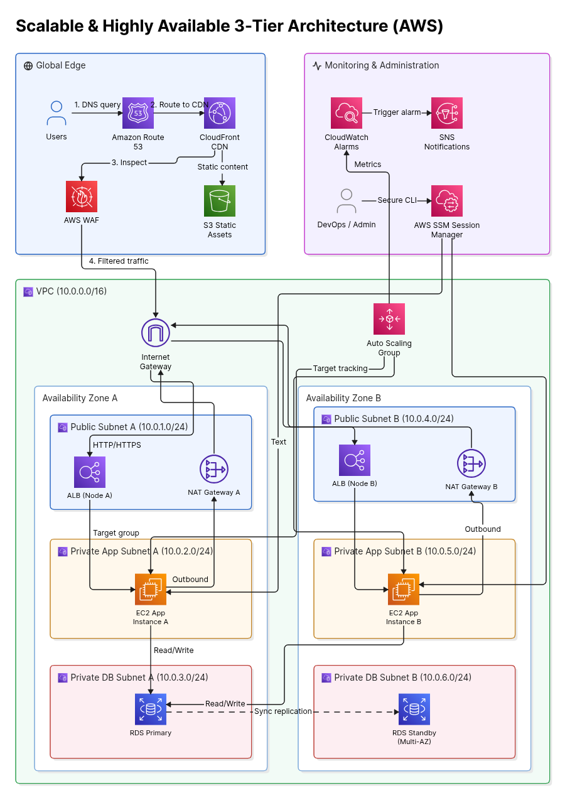

# Scalable Web Application with ALB and Auto Scaling
### 3-Tier, Multi-AZ Architecture on AWS

[](https://aws.amazon.com/)
[]()

> **Manara Program — Cloud Computing  Project**

---

## 1. Project Overview & Objectives

### 1.1 Summary

This project implements a **highly available, secure, and horizontally scalable 3-tier web application architecture** on Amazon Web Services. The design separates the system into three isolated tiers — **Presentation (Edge)**, **Application (Compute)**, and **Data (Database)** — distributed across **two Availability Zones (Multi-AZ)** to eliminate single points of failure.

Traffic is filtered and cached at the edge via **CloudFront** and **AWS WAF**, load-balanced across private compute nodes by an **Application Load Balancer (ALB)**, dynamically scaled via an **Auto Scaling Group (ASG)**, and persisted in a **Multi-AZ Amazon RDS** instance with synchronous replication and automated failover.

### 1.2 Objectives

| Objective | Implementation |
|---|---|
| **Eliminate single points of failure** | Dual-AZ deployment for ALB, EC2, NAT Gateways, and RDS |
| **Enforce network isolation** | 3-tier subnet segmentation (Public / Private-App / Private-DB) |
| **Automate elasticity** | ASG with Target Tracking scaling policies |
| **Harden the edge** | AWS WAF (OWASP Top 10 rules) + CloudFront caching |
| **Remove bastion hosts** | AWS Systems Manager (SSM) Session Manager for instance access |
| **Enable proactive operations** | CloudWatch Alarms → SNS notification pipeline |
| **Protect data at rest and in transit** | KMS-encrypted EBS/RDS volumes + TLS termination at ALB/CloudFront |

### 1.3 Learning Outcomes

- Designing production-grade VPC architectures with proper CIDR planning and route table segregation.
- Implementing defense-in-depth security across network (NACLs, SGs), application (WAF), and identity (IAM) layers.
- Configuring stateless, horizontally scalable compute tiers decoupled from persistent storage.
- Operating a bastion-free, auditable remote access model using AWS-native tooling.
- Building observability and automated alerting pipelines for infrastructure health.

---

## 2. Architecture Diagram



**Design tiers:**
- 🌐 **Global Edge** — Route 53, CloudFront, WAF, S3 (static assets)
- 🖥️ **Compute Tier** — ALB, Auto Scaling Group, EC2 (Private App Subnets)
- 🗄️ **Data Tier** — RDS Multi-AZ (Private DB Subnets)
- 📊 **Operations Plane** — CloudWatch, SNS, SSM Session Manager

---

## 3. End-to-End Architectural Flow

The numbered flow below traces a single user request from DNS resolution to database persistence.

### Step 1 — DNS Resolution
A user's browser issues a DNS query for the application domain. **Amazon Route 53** resolves this via an **Alias record** pointing to the CloudFront distribution, avoiding an extra CNAME lookup hop.

### Step 2 — Edge Routing & Caching
Route 53 routes the request to **Amazon CloudFront**. CloudFront serves cacheable static content (images, JS, CSS) directly from an **S3 origin (S3 Static Assets bucket)**, reducing origin load and latency. Dynamic requests are forwarded downstream.

### Step 3 — Edge Security Inspection
Before reaching application infrastructure, all traffic is inspected by **AWS WAF**, attached to the CloudFront distribution. WAF evaluates requests against managed rule groups (OWASP Top 10 — SQLi, XSS, LFI) and rate-based rules to block volumetric/brute-force abuse.

### Step 4 — Ingress into the VPC
Filtered, legitimate traffic is passed through the **Internet Gateway (IGW)** attached to the custom VPC (`10.0.0.0/16`), entering the **Public Subnet tier**.

### Step 5 — Load Balancing
The **Application Load Balancer (ALB)**, provisioned across **Public Subnet A** and **Public Subnet B**, terminates HTTP/HTTPS connections and evaluates listener rules. The ALB performs continuous **health checks** against registered targets and routes only to healthy EC2 instances via **Target Groups**.

### Step 6 — Application Compute
Requests are forwarded to **EC2 instances** running in **Private App Subnets** (one per AZ), launched and managed by an **Auto Scaling Group** using a standardized **Launch Template**. Instances have no public IP; all outbound traffic (patching, package installs, API calls) routes through the **NAT Gateway** in the corresponding AZ.

### Step 7 — Elastic Scaling
The ASG monitors **CloudWatch metrics** (CPU utilization / request count per target) and applies a **Target Tracking scaling policy**, adding or removing EC2 instances automatically to match demand across both AZs.

### Step 8 — Data Persistence
Application instances perform **Read/Write** operations against the **RDS Primary** instance in **Private DB Subnet A**. RDS **Multi-AZ** maintains a **synchronously replicated Standby** in **Private DB Subnet B**. The DB tier is fully isolated — no route to the Internet Gateway or NAT Gateway exists from this subnet group.

### Step 9 — Monitoring & Alerting
**CloudWatch Alarms** continuously evaluate metrics from ASG, ALB, and RDS. Breached thresholds **trigger alarms**, which publish to **Amazon SNS**, notifying the operations team in real time.

### Step 10 — Secure Operational Access
DevOps/Admin personnel connect to EC2 instances exclusively via **AWS Systems Manager Session Manager**, using IAM-authenticated, auditable CLI sessions — **no SSH keys, no bastion host, no open inbound port 22**.

---

## 4. Subnet & IP Allocation Table

**VPC CIDR:** `10.0.0.0/16`

| Subnet Name | Availability Zone | CIDR Block | Tier | Route Target | Internet Access |
|---|---|---|---|---|---|
| Public Subnet A | AZ-A | `10.0.1.0/24` | Public | `0.0.0.0/0` → Internet Gateway (IGW) | Yes (Inbound + Outbound) |
| Public Subnet B | AZ-B | `10.0.4.0/24` | Public | `0.0.0.0/0` → Internet Gateway (IGW) | Yes (Inbound + Outbound) |
| Private App Subnet A | AZ-A | `10.0.2.0/24` | Private (App) | `0.0.0.0/0` → NAT Gateway A | Outbound only (via NAT) |
| Private App Subnet B | AZ-B | `10.0.5.0/24` | Private (App) | `0.0.0.0/0` → NAT Gateway B | Outbound only (via NAT) |
| Private DB Subnet A | AZ-A | `10.0.3.0/24` | Private (Data) | Local VPC route only | None (fully isolated) |
| Private DB Subnet B | AZ-B | `10.0.6.0/24` | Private (Data) | Local VPC route only | None (fully isolated) |

**Routing notes:**
- Each AZ maintains **independent route tables** — Public, Private-App, and Private-DB tiers are never combined into a shared route table.
- **NAT Gateway A** and **NAT Gateway B** are deployed one per AZ (not shared) to avoid cross-AZ data transfer costs and to prevent a single NAT Gateway from becoming an AZ-level dependency.
- DB subnets have **no default route to `0.0.0.0/0`** — this is enforced at the route table level, not just the security group level, as a defense-in-depth control.

---

## 5. Security & Governance Matrix

| Layer | Control | Configuration |
|---|---|---|
| **Edge / WAF** | AWS WAF Web ACL | Managed rule groups for OWASP Top 10 (SQLi, XSS), rate-based rule to throttle abusive source IPs, attached to CloudFront distribution |
| **DNS** | Route 53 | Alias record (zone apex support, no extra DNS lookup); optionally paired with Health Checks for failover routing |
| **Content Delivery** | CloudFront + OAC | Origin Access Control (OAC) restricts S3 bucket access to CloudFront only — S3 bucket is **not publicly readable** |
| **Network ACLs (Subnet-level)** | Stateless filtering | Explicit allow/deny per subnet tier; DB subnet NACLs permit inbound only from App subnet CIDR ranges on the DB port |
| **Security Groups (Instance-level)** | Stateful, least-privilege | See chained SG model below |
| **Compute Access** | AWS SSM Session Manager | IAM-policy gated; no inbound SSH/RDP rules required on any Security Group; all sessions logged to CloudWatch Logs / S3 |
| **IAM** | Role-based, least privilege | EC2 Instance Profile scoped to SSM Core policy + application-specific permissions only (no wildcard `*` actions) |
| **Encryption in Transit** | TLS everywhere | Client → CloudFront (TLS via ACM), CloudFront → ALB (HTTPS), ALB → EC2 (HTTPS), EC2 → RDS (TLS/SSL enforced) |
| **Encryption at Rest** | AWS KMS | EBS volumes, RDS storage, and S3 bucket encrypted with KMS-managed (or CMK) keys |
| **Secrets Management** | AWS Secrets Manager | Database credentials injected at runtime; no hardcoded credentials in Launch Template / AMI |
| **Monitoring / Audit** | CloudWatch + CloudTrail | API-level audit trail (CloudTrail) + resource-level metrics/alarms (CloudWatch) |

### 5.1 Security Group Chaining Model

Traffic is only permitted to flow **one tier at a time**, referencing security group IDs rather than CIDR ranges:

```
Internet (0.0.0.0/0)
    │  (HTTPS 443)
    ▼
[ALB-SG]  ── allows 443 from 0.0.0.0/0 (via WAF/CloudFront)
    │  (HTTP/HTTPS)
    ▼
[App-SG]  ── allows app port ONLY from ALB-SG
    │  (DB port, e.g. 3306/5432)
    ▼
[DB-SG]   ── allows DB port ONLY from App-SG
```

No tier accepts inbound traffic directly from the internet except the ALB, and the ALB itself only accepts traffic that has already passed through WAF inspection.

---

## 6. High Availability & Fault Tolerance Strategy

| Component | HA Mechanism | Failure Behavior |
|---|---|---|
| **Compute (EC2/ASG)** | Instances distributed across 2 AZs; ASG maintains minimum healthy capacity per AZ | If an AZ fails, ASG launches replacement capacity in the healthy AZ automatically |
| **Load Balancer** | ALB deployed across both Public Subnets (A & B) | ALB is a managed, multi-AZ service by default — no single point of failure |
| **Health Checks** | ALB target group health checks (HTTP path-based) | Unhealthy targets are automatically deregistered from rotation within the configured interval/threshold, preventing traffic from reaching failed instances |
| **Auto Scaling** | Target Tracking policy (e.g., 60% avg CPU or ALB request count per target) | Scales out under load, scales in during idle periods, maintaining cost-efficiency and availability simultaneously |
| **NAT Gateways** | One NAT Gateway per AZ (A and B) | Removes cross-AZ dependency — an AZ-A NAT failure does not affect AZ-B outbound traffic |
| **Database (RDS)** | Multi-AZ deployment with synchronous replication to Standby | On Primary failure, RDS performs **automated failover** to the Standby, updating the DB endpoint's DNS CNAME — typically a 60–120 second RTO with **zero data loss (RPO ≈ 0)** due to synchronous commit |
| **Static Assets** | S3 (11 nines durability) + CloudFront edge caching | Origin failure does not affect already-cached edge content; S3 itself is regionally redundant |
| **DNS Layer** | Route 53 (100% SLA, globally distributed anycast) | Can be extended with health-check-based failover routing to a secondary region for DR |

**Design principle:** every tier that can fail has either (a) a redundant standby in a second AZ, or (b) is a globally managed, inherently multi-AZ AWS service (Route 53, CloudFront, S3, ALB).

---

## 7. Step-by-Step Deployment Guide

Deployment follows a **bottom-up dependency order**: network foundation → data tier → compute tier → edge/global services → observability.

### Phase 1 — Networking Foundation (VPC)
1. Create VPC `10.0.0.0/16` with DNS resolution and DNS hostnames enabled.
2. Create 6 subnets per the [Subnet Allocation Table](#4-subnet--ip-allocation-table) across two AZs.
3. Create and attach an **Internet Gateway** to the VPC.
4. Provision **NAT Gateway A** and **NAT Gateway B**, each with an Elastic IP, placed in Public Subnet A and B respectively.
5. Create route tables:
   - Public RT → `0.0.0.0/0` → IGW (associate with Public Subnets A/B)
   - Private App RT (A) → `0.0.0.0/0` → NAT Gateway A
   - Private App RT (B) → `0.0.0.0/0` → NAT Gateway B
   - Private DB RT → local only, no internet route (associate with DB Subnets A/B)
6. Configure NACLs per subnet tier and baseline Security Groups (`ALB-SG`, `App-SG`, `DB-SG`).

### Phase 2 — Data Tier (RDS)
7. Create a **DB Subnet Group** spanning Private DB Subnet A and B.
8. Launch **Amazon RDS (MySQL/PostgreSQL)** with **Multi-AZ enabled**, encrypted storage (KMS), and `DB-SG` attached.
9. Store the generated master credentials in **AWS Secrets Manager**.
10. Validate the Standby replica is provisioned and `Multi-AZ: Yes` in the RDS console.

### Phase 3 — Compute Tier (Launch Template + ASG)
11. Build/validate an AMI or use a base AMI with a **bootstrap (user-data) script** that installs the app runtime and retrieves DB credentials from Secrets Manager.
12. Attach an **IAM Instance Profile** with SSM Core + Secrets Manager read permissions (no SSH key required).
13. Create a **Launch Template** referencing the AMI, instance profile, and `App-SG`.
14. Create an **Auto Scaling Group** across Private App Subnet A and B:
    - Min/Desired/Max capacity (e.g., 2/2/6)
    - Attach a **Target Tracking scaling policy** (e.g., Average CPU 60%)
    - Attach to the Target Group created in Phase 4.

### Phase 4 — Load Balancing & Edge
15. Create an **Application Load Balancer** across Public Subnet A and B, with `ALB-SG` attached.
16. Create a **Target Group** (HTTP/HTTPS, health check path e.g. `/health`) and register it with the ASG.
17. Configure ALB listener rules (443 → forward to Target Group; 80 → redirect to 443).
18. Request/attach an **ACM certificate** for TLS termination at the ALB.
19. Create an **S3 bucket** for static assets; configure **CloudFront** with the ALB as the dynamic origin and S3 as the static origin (via Origin Access Control).
20. Create an **AWS WAF Web ACL** with managed OWASP rule groups + rate-based rule; associate it with the CloudFront distribution.
21. Create a **Route 53 Alias record** pointing the application domain to the CloudFront distribution.

### Phase 5 — Monitoring & Governance
22. Create **CloudWatch Alarms** on: ASG CPU/instance count, ALB 5xx error rate & target health, RDS CPU/storage/replica lag.
23. Create an **SNS Topic** and subscribe the operations team (email/Slack/PagerDuty integration).
24. Attach each CloudWatch Alarm's action to the SNS topic.
25. Confirm **SSM Session Manager** connectivity to a running EC2 instance (no inbound SSH port open).

---

## 8. Verification & Testing

### 8.1 Auto Scaling Group (Scale-Out / Scale-In)

| Test | Method | Expected Result |
|---|---|---|
| Trigger scale-out | Generate synthetic CPU load on an instance (e.g., `stress-ng --cpu 4 --timeout 300s`) or use a load-testing tool against the ALB DNS name | ASG launches additional instances once the Target Tracking threshold is breached; CloudWatch shows increased instance count |
| Trigger scale-in | Stop the load generator and wait for the cooldown period | ASG terminates excess instances once average CPU falls below threshold, returning to desired capacity |
| Multi-AZ balance | Inspect ASG "Instances" tab during scaling events | New instances are distributed across both AZ-A and AZ-B, not concentrated in one AZ |

### 8.2 ALB Health Checks

| Test | Method | Expected Result |
|---|---|---|
| Simulate unhealthy target | Manually stop the application process on one EC2 instance (via SSM Session Manager) | Target Group marks the instance `unhealthy` after the configured threshold; ALB stops routing traffic to it |
| Recovery detection | Restart the application process | Target returns to `healthy` and resumes receiving traffic automatically |
| Zero-downtime validation | Continuously curl the ALB/CloudFront endpoint during the above test | No failed requests observed — traffic is seamlessly served by the remaining healthy target(s) |

### 8.3 RDS Multi-AZ Failover

| Test | Method | Expected Result |
|---|---|---|
| Forced failover | In the RDS console, select the DB instance → **Actions → Reboot with failover** | RDS promotes the Standby to Primary; DB endpoint CNAME updates transparently |
| Application resilience | Monitor the application's DB connection during failover | Brief connection interruption (typically 60–120s), followed by automatic reconnection — no manual intervention or endpoint change required |
| Data integrity check | Write a test record immediately before triggering failover; read it back after failover completes | Record is present post-failover, confirming synchronous replication and zero data loss |

### 8.4 Security Validation

| Test | Method | Expected Result |
|---|---|---|
| WAF rule enforcement | Send a request with a known SQLi payload (e.g., `' OR '1'='1`) to the CloudFront endpoint | Request is blocked (HTTP 403) by AWS WAF before reaching the ALB |
| Network isolation | Attempt to `ping`/connect directly to an EC2 private IP or RDS endpoint from the public internet | Connection times out — no route exists (private subnets have no IGW route) |
| SSH port exposure | Run a port scan (e.g., `nmap`) against instance public-facing surfaces | Port 22 is closed/filtered on all instances; access is available only via SSM Session Manager |

---

## Repository Structure

```
.
├── architecture-diagram.png     # Architecture diagram (referenced above)
├── README.md                    # This file
```

---

## Tech Stack Summary

`Amazon VPC` · `Route 53` · `CloudFront` · `AWS WAF` · `Amazon S3` · `Application Load Balancer` · `EC2 Auto Scaling` · `Amazon RDS (Multi-AZ)` · `AWS Systems Manager` · `Amazon CloudWatch` · `Amazon SNS` · `AWS KMS` · `AWS Secrets Manager` · `IAM`

---
## Acknowledgments

I would like to extend my sincere gratitude to my instructor, **Ayman Aly Mahmoud**, for his invaluable guidance, expertise, and continuous mentorship throughout the Manara Cloud Architecture program. His support and insights have been instrumental in the successful design and implementation of this  project.

## Author

**Mohamed Jaa**

Built as a demonstration of production-grade, highly available AWS architecture design principles.
